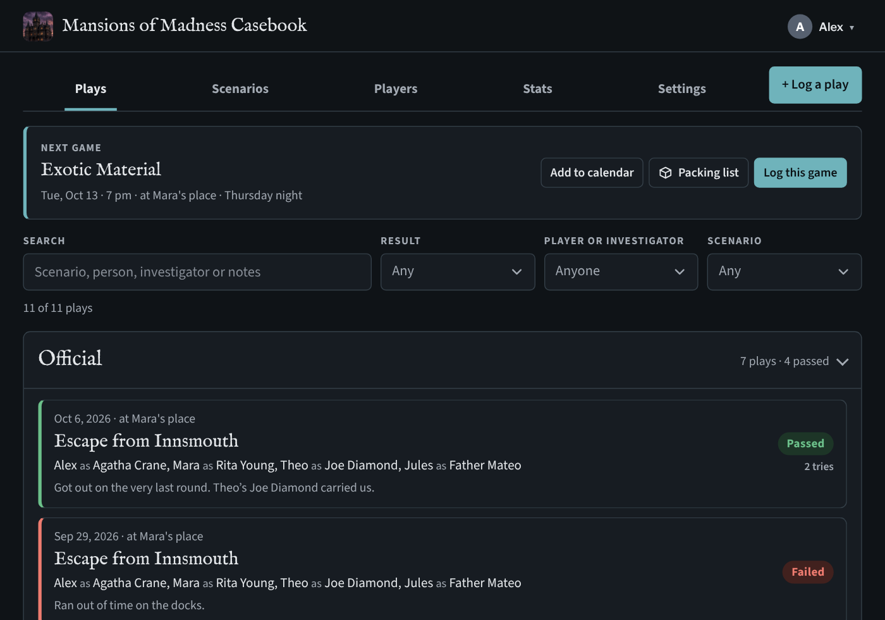
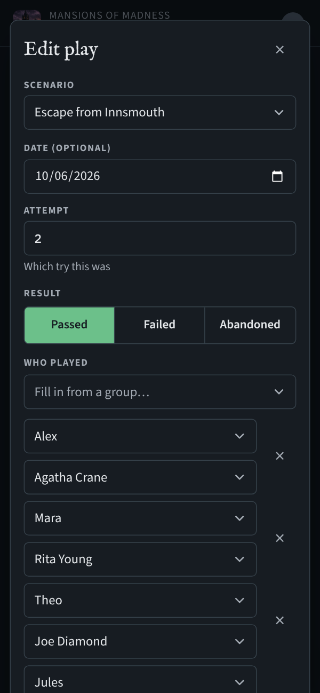
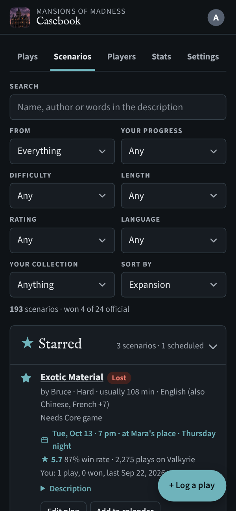
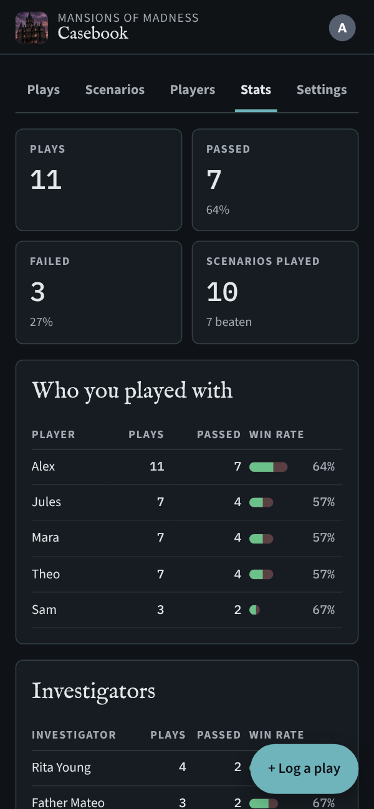
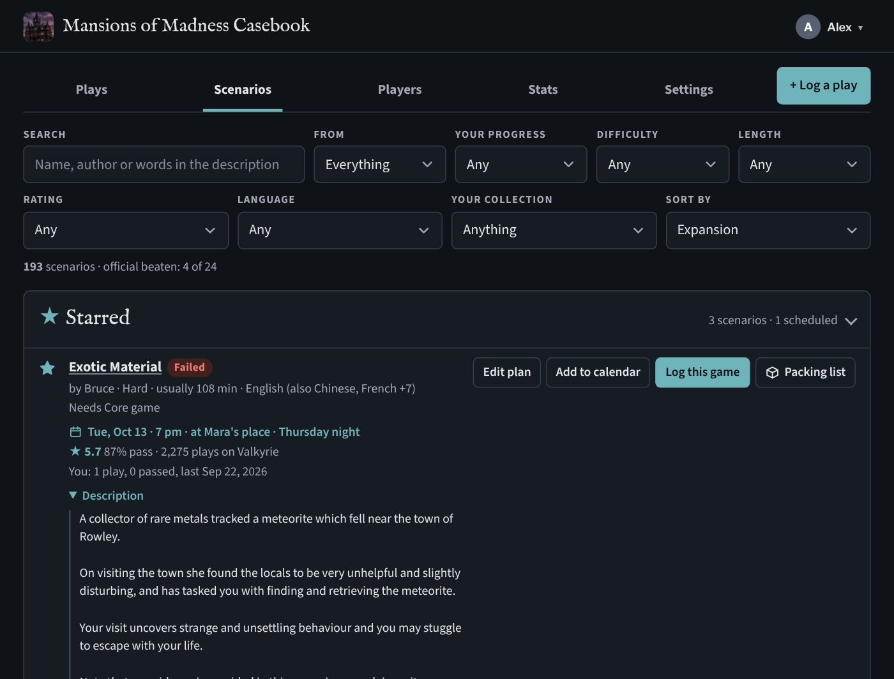
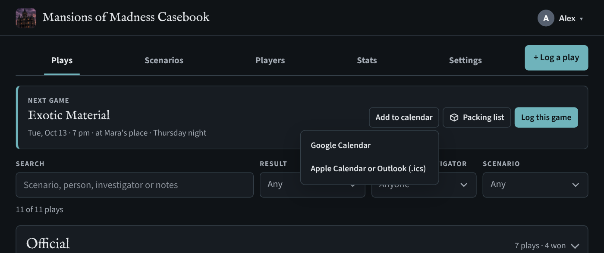
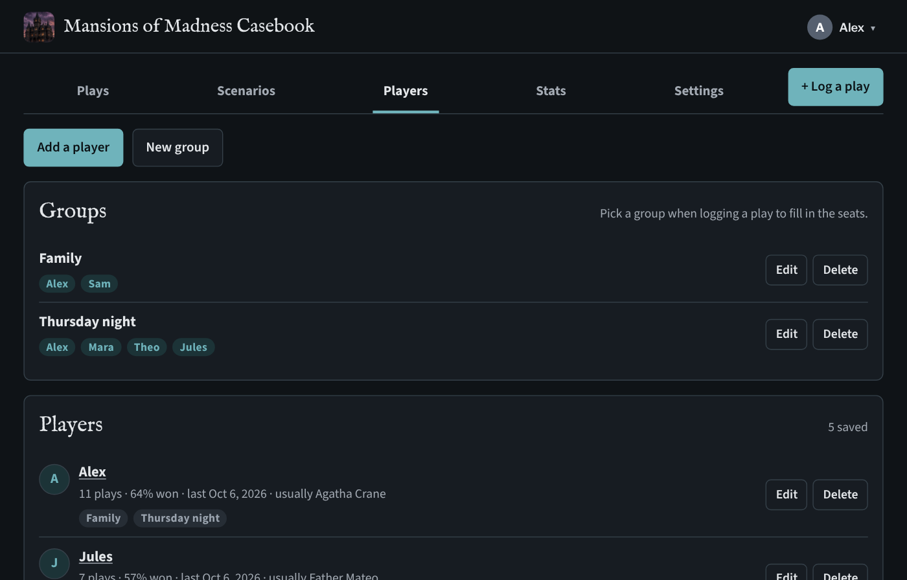
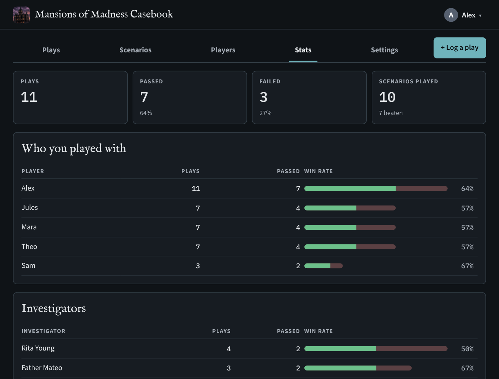
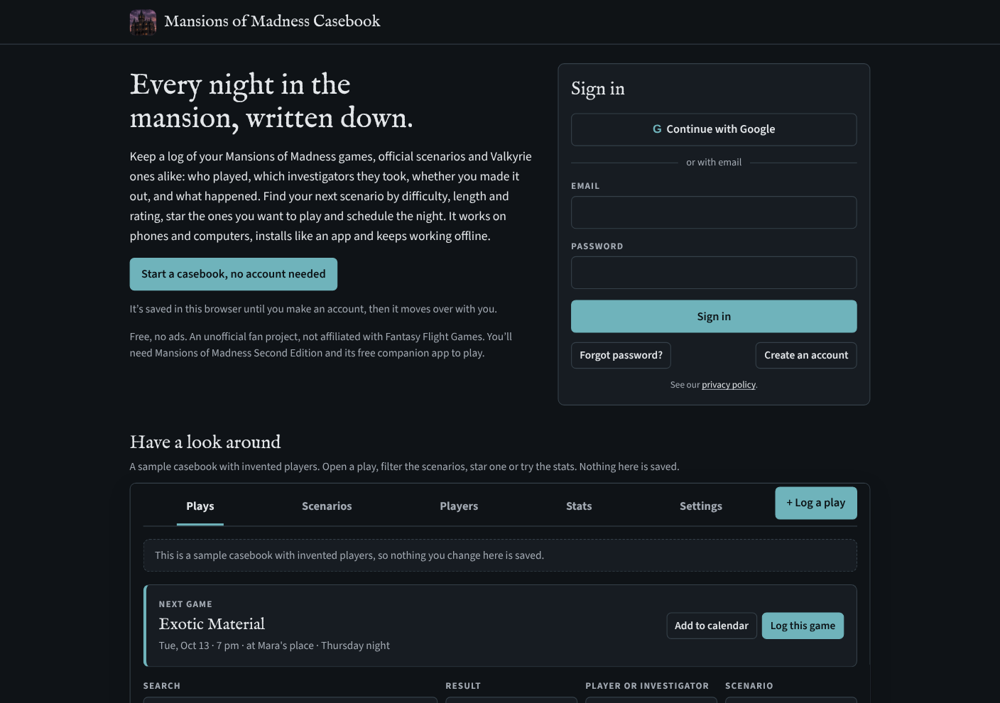

# Mansions of Madness Casebook

A play log for Mansions of Madness (Second Edition), at **https://momcasebook.web.app**.

Log every game, official app scenarios and Valkyrie ones alike: who played, which investigators they took, whether you made it out, which attempt it was, the rules you used and what happened. Find your next scenario by difficulty, length and rating, star the ones you want to play and schedule the night. Sign in with Google or an email, or try it first with no account: the casebook is saved in your browser and moves to your account when you sign up. It works on phones and computers, installs like an app and keeps working offline.

It's a free, unofficial fan project, not affiliated with or endorsed by Fantasy Flight Games. You need Mansions of Madness Second Edition and its free companion app to play.

This repo is the code behind the live site. It isn't packaged for running your own copy; to use it, just use the site.

## What it does

- **Welcome page.** Signed out, it's laid out like the Arkham Horror RPG Ledger's: a short intro beside the sign-in card, then **Have a look around**, the real app in a frame running a sample casebook with invented players, games, groups and a scheduled night (`js/demo.js`; nothing in it is saved). On a phone it's intro, sample, then sign-in.
- **No account needed.** **Start a casebook, no account needed** keeps everything in this browser (`js/localfb.js`, a small in-browser stand-in for the Firebase calls the app makes), with a banner offering **Save to an account**. Signing in or creating an account from there copies the plays, players, groups, stars and profile into the account and clears the browser copy.
- **Plays.** Grouped in collapsible **Official** and **Valkyrie** boxes (open or closed is remembered). Log a play in a few taps: scenario, date, result (Passed, Failed or Abandoned), which attempt it was, each player and their investigator, rules, notes. Pick each player from your known players or type a new name (on a computer a list narrows as you type; on a phone it's the phone's own picker, with **Someone new…** for typing). The same person can take two seats, and picking someone fills in the investigator they usually take. Search and filter by result, person, investigator or scenario. Tap a play to edit or delete it.
- **Scenarios.** All 24 official app scenarios grouped by the product that unlocks them, plus the 168 Valkyrie fan scenarios from the Valkyrie app's own catalogue (with author, difficulty and length). Each shows Beaten / Failed / Not played; search by name or author. Tick the products you own in Settings, where the Valkyrie list can be switched off too (ones you've played still show).
- **Official and Valkyrie scenarios only.** Every play is one of the 24 official scenarios or a Valkyrie scenario; custom scenarios can't be saved (the database rules enforce it). Imports match names automatically when they're sure ("Altered Fate" → Altered Fates, "Escape Innsmouth" → Escape from Innsmouth, noted on the play) and otherwise ask you to pick from the best guesses or skip those rows. Plays from older versions that named their own scenarios get a **Match them** prompt on the Plays tab.
- **Official investigators only.** Each seat picks from the 40 Second Edition investigators (grouped by box) or Unknown; custom characters can't be saved, and the database rules enforce it. Imports map names like "Tommy" or "Ashcan Pete" to the official ones and leave anything else as Unknown (noted on the play). If older plays hold a non-official name, the Plays tab offers **Fix them**, with each name pre-matched to its official investigator.
- **Scenarios list.** Every scenario you can play, in collapsible **Official** and **Valkyrie** boxes (open or closed is remembered): filter by source, your progress, difficulty, length, rating and language (Valkyrie scenarios list their original language and translations); sort by expansion (official scenarios grouped under the core game or the expansion that unlocks them), name, highest rated, most played, shortest, longest, easiest, hardest, easiest to pass, language or most recently played. Each shows its difficulty, the author's description for Valkyrie scenarios and a short spoiler-free premise for official ones (written for this site from linked sources, in `js/official-info.js`; search covers both), typical length (Valkyrie players' real average where known), the Valkyrie players' average score out of 10, pass rate and play count, your own record, and any published reviews (`js/reviews.js`: hand-collected, linked and summarised in our own words). Difficulty, length and rating aren't published for the official scenarios, so those filters only cover Valkyrie ones.
- **Where you played.** An optional location on each play, suggested from your past places (a new play starts empty), searchable and counted in Stats.
- **Starred and scheduled.** Star scenarios you want to play soon (the star is at the start of every scenario row); they gather in a **Starred** box at the top of the Scenarios tab. **Schedule** one with a date, optional time, place, group and note; scheduled games sort first, show on the Plays tab as **Next game**, and can be added to Google Calendar or Apple Calendar/Outlook (.ics). **Log this game** opens the play form filled in from the plan (scenario, the group's players, place, date) and takes it off the starred list once saved.
- **Play again.** Scenarios you've played show **Play again** (with a replay icon) instead of Log a play: the form opens with the same players, investigators, rules and place as last time, and the attempt number goes up after a fail.
- **Packing lists.** Every Valkyrie scenario has a **Packing list** (also on the Next game card): the tiles it uses, numbered as in the community [Mansions of Madness Tiles Index v5.2](https://boardgamegeek.com/filepage/147448/mansions-of-madness-tiles-index), each with a colour-coded tag for the set whose symbol is printed on it (Core, 1E, CotW, FA, BtT, SoA, SoT, HJ, PotS; first-edition pieces also say which box reprints them) and the side on its back, the tiles only needed for 6 players, and the monster figures (with the custom monsters each one stands in for). Tick things off as you pack; the ticks stay on that device. Each scenario also says which boxes it **needs**, flagging any not ticked in Settings, and the Scenarios tab can show only those **Playable with what I own**. It's the website version of Dan's [valkyrie-tools packlist](https://github.com/maniac782/valkyrie-tools/tree/main/packlist), built from each scenario file by `scripts/fetch-packlists.py` and refreshed with the weekly Valkyrie update. No tile or monster art (house rule 2), just names, numbers and boxes.
- **Players.** The people you play with, without them needing accounts: just their names and an optional note, with plays, pass rate, last game and their usual investigator. Put them in **groups** (one person can be in several); when logging a play, pick a group to fill in the seats, then adjust for that scenario. Names already typed into plays can be saved with one tap, and renaming someone can update their past plays too.
- **Stats.** Win rates per person, per investigator, per scenario, by party size, by rules variant and by scenario type. A person who plays two characters in one game counts once for that game (names match ignoring case); party size counts people, so one person running two investigators is solo.
- **Import.** From a Google Sheet link (shared as "Anyone with the link") or a CSV file. Understands the original tracking sheet's columns (*Scenario, Played, Characters, Pass/Fail, Notes, Rules*) and this site's own export. Short investigator names are expanded ("Tommy" → Tommy Muldoon); "Passed on 3rd try" becomes a pass on attempt 3; rows marked N under Played are skipped; anything already imported is never added twice.
- **Profile pictures.** In the account menu (your picture and name, top right; built to look and behave exactly like the Arkham Horror RPG Ledger's, down to the same class names and styles), **Your account** lets you choose a picture, position and zoom it in a circle, and change your name; it shows on your account button (and in the admin page's account list). Google sign-ins use their Google photo until they pick one.
- **Export.** CSV (opens in any spreadsheet, and imports back) and a JSON backup. Delete all plays, or the whole account, from Settings.
- **Dropdown menus.** Every dropdown opens the site's own menu rather than the browser's plain list: a tick on the current choice, group headings, hover and keyboard highlighting (arrows, Enter, Escape, type a letter to jump), and a search box on long lists such as scenarios and investigators. On phones and tablets a tap opens the device's own picker instead. The underlying fields are still ordinary selects, so forms and filters work as before (`js/shared.js`, *Dropdowns*).
- **Installable and offline.** Install app is in the account menu. Plays logged offline sync when you're back online.

<table>
<tr>
<td width="33%"></td>
<td width="33%"></td>
<td width="33%"></td>
</tr>
<tr>
<td align="center">Log a play at the table</td>
<td align="center">Find, star and schedule scenarios</td>
<td align="center">Your stats</td>
</tr>
</table>

**Scenarios:** all 24 official scenarios and the Valkyrie catalogue, with difficulty, length, the Valkyrie players' ratings and pass rates, descriptions and premises, your own record, and filters to find the next one. Starred ones sit at the top with their plans.

**The next game:** schedule a starred scenario with a date, time, place and group, and add it to Google Calendar, Apple Calendar or Outlook.

<table>
<tr>
<td width="50%"></td>
<td width="50%"></td>
</tr>
<tr>
<td align="center">Players and groups</td>
<td align="center">Stats</td>
</tr>
</table>

**Signed out:** an intro beside the sign-in card, and the sample casebook to look around in.

Screenshots use the made-up sample casebook (`js/demo.js`). Retake them with `scripts/screenshots.js`.

---

## Setup (one time)

Everything here is done in your browser; no secrets go into the code or into chat.

1. **GitHub:** create an empty repository `maniac782/momcasebook` (no README) and push this code to it.
2. **Firebase:** at <https://console.firebase.google.com>, *Add project*. Use the ID `momcasebook` if it's free (the site is then **momcasebook.web.app**); if it's taken, choose another and put it in `.firebaserc`. Analytics: off. The free Spark plan is enough; nothing here needs Blaze.
   - *Build → Authentication → Get started*: enable **Google** and **Email/Password**.
   - *Build → Firestore Database → Create database*: production mode, a US location.
   - *Build → Hosting → Get started*: just click through (the workflow does the deploying).
   - *Project settings → Your apps → Web (`</>`)*: register an app named "Mansions of Madness Casebook". You don't need to copy its settings; Hosting serves them to the site at `/__/firebase/init.json`.
3. **Deploy key:** in Google Cloud for that project (<https://console.cloud.google.com/iam-admin/serviceaccounts>), create a service account `github-deploy` with the roles **Firebase Hosting Admin**, **Firebase Rules Admin**, **API Keys Viewer** and **Service Usage Consumer**. Under *Keys → Add key → JSON*, download the key. In GitHub, *Settings → Secrets and variables → Actions → New repository secret*: name it `FIREBASE_SERVICE_ACCOUNT` and paste the whole file there (only there). Then delete the downloaded file.
4. **Deploy:** push to `main`, or *Actions → Deploy to Firebase → Run workflow*. It runs the tests, then publishes the site and `firestore.rules`.
5. **Make yourself admin:** sign in on the site once. In Firebase *Authentication → Users*, copy your **User UID**. In *Firestore*, start collection `admins`, document ID = that UID, no fields. The account menu then shows **Admin**.
6. **Import your sheet:** *Settings → Import from a spreadsheet*, paste the sheet link, *Load sheet*, check the preview, *Import*. The old sheet didn't record who played, so open each play to add people.

## Admin page

`admin.html`, for accounts with an `admins/{uid}` document (the rules enforce it):
- **Accounts:** name, email, plays logged, joined, last seen. (Admins can't see anyone's plays.)
- **Shared scenarios:** add Valkyrie (or missing official) scenarios that everyone can pick when logging.
- **Feedback** sent from the account menu, and **Errors** recorded automatically while people are signed in.

## How it's built

Plain HTML, CSS and JavaScript, no build step. Firebase compat SDK 10 (Authentication, Firestore with offline persistence), Firebase Hosting, a service worker for the offline app shell.

| File | What it is |
|---|---|
| `index.html`, `js/app.js` | The main app: sign-in, Plays, Scenarios, Players, Stats, Settings |
| `admin.html`, `js/admin.js` | The admin page |
| `js/catalog.js` | Official scenarios by product, the 40 official investigators, name matching |
| `js/reviews.js` | Published reviews of scenarios, collected by hand: source link, date and a one-line summary written for this site |
| `js/valkyrie.js` | The built-in Valkyrie scenario list. Generated by `scripts/fetch-valkyrie.py`; re-run it to pick up new scenarios, then bump the version |
| `js/importer.js` | Google Sheets / CSV import and CSV export (pure functions, tested in Node) |
| `js/config.js` | Firebase start-up (settings from `/__/firebase/init.json`), error reporting, service worker registration |
| `js/shared.js` | Account menu, Install app, Send feedback, dialogs, toasts |
| `js/localfb.js`, `js/demo.js` | A casebook kept in the browser with no account, and the sample casebook on the welcome page (a small in-browser stand-in for the Firebase calls the app makes) |
| `js/packlists.js`, `scripts/fetch-packlists.py`, `scripts/tiles_index.py`, `scripts/tiles-index-from-pdf.py` | Packing lists for the Valkyrie scenarios, generated weekly from each scenario file. Tile numbers come from the Tiles Index v5.2 PDF (read by `tiles-index-from-pdf.py`, which matches each row's set symbol to the PDF's legend; the PDF itself isn't stored here); names, sets and boxes from Valkyrie's game content |
| `js/version.js` | **The version number**, bumped on every change |
| `sw.js` | Offline copy of the site; cache named after the version |
| `css/app.css` | All styles, light and dark themes |
| `firestore.rules` | Who can read and write what |
| `.github/workflows/deploy.yml` | Tests, then deploys Hosting and the rules on every push to `main` |
| `.github/workflows/valkyrie-refresh.yml` | Every Monday: refreshes `js/valkyrie.js` from the Valkyrie catalogue, bumps the version, commits and deploys |
| `docs/screenshots/`, `scripts/screenshots.js` | The README pictures, taken from the sample casebook in dark mode. They aren't published on the site. Retake: `PW=<playwright> CHROME=<chromium> FONTS=<google/fonts clone> node scripts/screenshots.js` |
| `test/` | `importer.test.js`, `house-rules.test.js` (version bump, no yellow), `ui.test.js` (headless end-to-end with a fake Firebase) |

### Data

- `users/{uid}`: name, email, created, lastSeen, playCount, owned products, hideValkyrie, starred ({scenarioId: {at, plan?: {date, time, location, groupId, note}}}), photo (a 256×256 JPEG as a data URL, under 60,000 characters; kept in Firestore because Cloud Storage now needs the paid Blaze plan).
- `users/{uid}/plays/{id}`: scenarioId, scenarioName, scenarioType (official / valkyrie), date, result, attempts, party `[{player, investigator}]`, solo, rules, notes, created, updated (and importKey, seq for imported rows).
- `users/{uid}/scenarios/{id}`: personal scenarios from older versions; no longer created, and removed once no play needs them.
- Investigators in `party` must be one of the official names in `investigators()` in `firestore.rules`, the same list as `js/catalog.js` (CI checks they match; sources noted there).
- `users/{uid}/people/{id}`: regular players (name, notes). `users/{uid}/groups/{id}`: groups of them (name, members: people ids). Plays store player names as text, so deleting a player leaves past plays as they were.
- `scenarios/{id}`: shared scenarios from the admin page (official or Valkyrie only). `admins/{uid}`, `feedback`, `errors` as above.

### Valkyrie scenarios
**Refreshed automatically every Monday** by `.github/workflows/valkyrie-refresh.yml`: it runs the script below, and if anything changed (new scenarios or updated community numbers) it bumps the version, runs the tests, commits and starts the deploy. It can also be run by hand from the Actions tab (*Refresh Valkyrie scenarios → Run workflow*). Scenarios that leave the catalogue are kept, marked retired, so old plays keep their details.

The list comes from [NPBruce/valkyrie-store](https://github.com/NPBruce/valkyrie-store) (`MoM/manifestDownload.ini`), the catalogue the Valkyrie app downloads. Kept: names (version tags removed), authors, difficulty, play length, languages, each author's description, and the catalogue's community numbers: plays, pass rate, average length and average rating (players score 1 to 10 after a game; individual comments aren't published). Hidden entries are skipped. To refresh: `python3 scripts/fetch-valkyrie.py`, bump `js/version.js`, push. A scenario newer than the built-in list can also be added for everyone on the admin page.

### Costs

On the free Spark plan: Firestore's free daily reads and writes are far beyond what a play log uses, and Hosting and Authentication are free at this size.

## Credits and licences

Official scenario premises are written for this site in our own words from the sources linked on each (Fantasy Flight's articles and press coverage); Fantasy Flight's own scenario text isn't copied. If Fantasy Flight gives written permission to use their descriptions, replace these with their wording verbatim.

Valkyrie scenario names, details, statistics and descriptions come from the [Valkyrie scenario catalogue](https://github.com/NPBruce/valkyrie-store), published under the Apache License 2.0 (copy and notes in `third_party/valkyrie-store/`). Descriptions are by each scenario's author and credited on the site.

Packing lists are the website version of Dan's own [valkyrie-tools packlist](https://github.com/maniac782/valkyrie-tools/tree/main/packlist). Tile numbers follow the community [Mansions of Madness Tiles Index v5.2](https://boardgamegeek.com/filepage/147448/mansions-of-madness-tiles-index) (numbers, names and sets only; Fantasy Flight's set symbols aren't used, so sets are short colour-coded tags); tile and monster names and boxes come from the [Valkyrie app's game content](https://github.com/NPBruce/valkyrie) (Apache License 2.0; notes in `third_party/valkyrie/`), and each scenario file is only read to list what it uses.

## Art

The site icon is Dan's own image, made with an AI image generator for this site (`art/icon-source.png`); `scripts/make-icons.py` builds every icon size from it. Other than that, only public-domain art is used. Fonts: IM Fell English (a revival of the 17th-century Fell types), Source Sans 3, Libre Franklin (the account menu, matching the Arkham site) and IBM Plex Mono, from Google Fonts.
